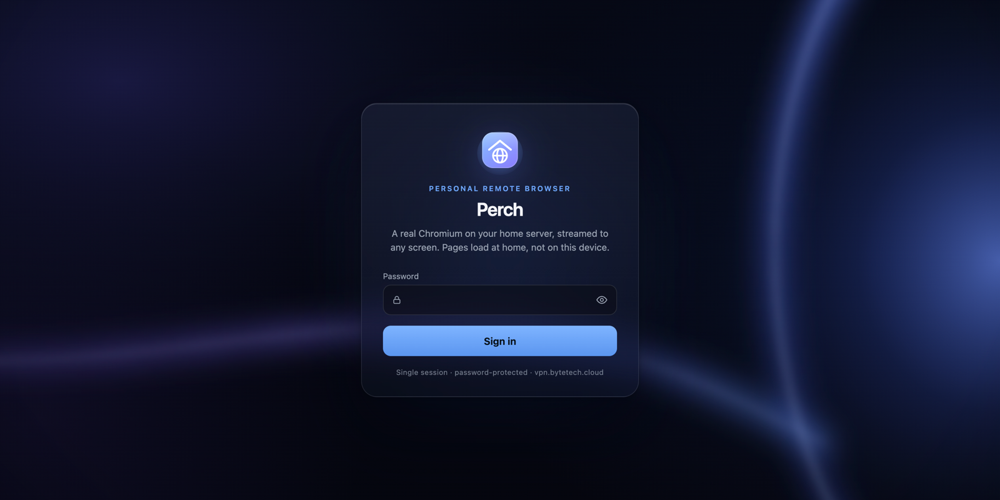
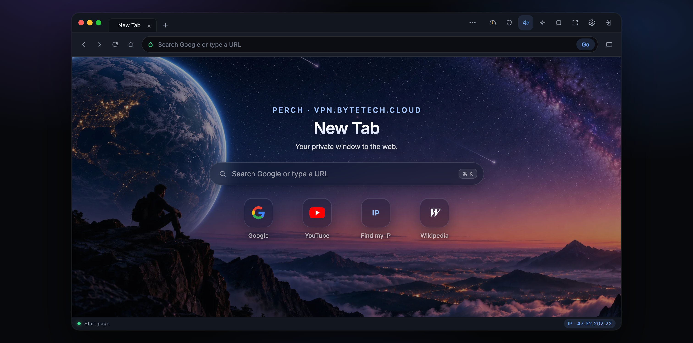

# Perch

**Perch is a personal remote browser.** A real Chromium runs on your home server and streams to any phone or laptop; the pages actually load **at home**, not on the device in your hand. Open a desktop-style browser UI anywhere, and frames stream into the viewport over WebSocket. Mouse, wheel, keyboard, and paste are forwarded with the Chrome DevTools Protocol.

This is **not** a VPN, **not** an HTML-rewriting proxy, and **not** an `<iframe>` of google.com (that is blocked by almost every site). It is a real remote Chromium — your own vantage on the web, kept at home.

> The npm package is named `home-browser` and the Docker image is `perch-browser`; **Perch** is the product name.

## Screenshots

**Sign in** — password-only, single session. The host name shown reflects wherever you open it.



**The browser** — real tabs, the new-tab page with search and shortcuts over the bundled wallpaper, the tools in the title bar (latency, ad blocker, sound, focus, settings), and the home server's live egress IP in the status bar.



## Features

- **Real Chromium, streamed.** Pages render on the home server and stream as binary JPEG frames over WebSocket; input is forwarded with the Chrome DevTools Protocol.
- **Egress from home.** Every site sees your home network's public IP, not the device in your hand.
- **Sound.** What Chromium plays at home — video, music, calls — streams to the device as Opus (or raw PCM on browsers without WebCodecs), with a mute button in the title bar.
- **Ad blocker.** One click on the shield in the title bar blocks ads, trackers, video ads, pop-ups, and cookie banners with the EasyList and uBlock Origin filter lists — and because ads are never rendered, there is less to stream.
- **Settings.** A settings page for choosing which tools appear in the top bar, the new-tab wallpaper (upload your own), search engine, home page, and stream quality — saved on the server and shared by every device.
- **Tabs.** A real tab strip to open, switch, and close tabs. Popups and SSO windows take over the view and hand it back when closed.
- **Non-blocking navigation.** Keep full mouse and keyboard control while a page loads, with no stale frames after a URL change.
- **Sign-in friendly.** Real key events, hover-before-click, and no automation banner, so Google's "are you human?" checks and corporate SSO behave like a local browser.
- **Phone-ready, and installable.** Touch scrolling, tap-to-click, long-press right-click, an on-screen keyboard, and a viewport sized to your screen. Add it to your home screen and it runs as a full-screen app (PWA).
- **Single session.** One shared browser; a second login joins — and can take over — the same tabs and cookies.

## Table of contents

- [Requirements](#requirements)
- [Run with Docker (recommended)](#run-with-docker-recommended)
- [Run natively (Ubuntu / Debian)](#run-natively-ubuntu--debian)
- [Configuration](#configuration)
- [Verify it works](#verify-it-works)
- [Usage](#usage)
- [How it works](#how-it-works)
- [Reverse proxy (TLS)](#reverse-proxy-tls)
- [Health](#health)
- [Security notes](#security-notes)
- [License](#license)

## Requirements

- Docker and Docker Compose (recommended), **or** Node.js 20+ with Google Chrome / Chromium installed
- A password for `APP_PASSWORD`

Single Chromium session: there is one browser process. A second login uses — and can take over — that same session, sharing its cookies, tabs, and page.

## Run with Docker (recommended)

A prebuilt image is published on Docker Hub as [`dpksamir/perch-browser`](https://hub.docker.com/r/dpksamir/perch-browser), so there is nothing to build — and with `docker run` you do not even need to clone this repository:

```bash
docker pull dpksamir/perch-browser:latest
```

Both methods below use that image. It bundles Chromium, Xvfb, PulseAudio, and ffmpeg, and is rebuilt from `main` whenever the app changes.

### Docker Compose

1. Create your configuration from the template and set a password:

   ```bash
   cp .env.example .env
   nano .env                     # set APP_PASSWORD
   ```

2. Start the container:

   ```bash
   docker compose up -d
   ```

3. Follow the logs:

   ```bash
   docker compose logs -f
   ```

Stop it with:

```bash
docker compose down
```

### `docker run`

Straight from Docker Hub, no checkout required:

```bash
docker volume create perch-chrome-profile

docker run -d \
  --name perch-browser \
  --restart unless-stopped \
  -p 8080:8080 \
  -e APP_PASSWORD="choose-a-long-password" \
  -e APP_USER="admin" \
  -v perch-chrome-profile:/data/chrome \
  --shm-size="1gb" \
  dpksamir/perch-browser:latest
```

Then open `http://<server>:8080` and sign in. To update later, pull the new image and recreate the container (the profile volume keeps your cookies and ad-blocker settings):

```bash
docker pull dpksamir/perch-browser:latest
docker rm -f perch-browser    # then repeat the docker run command above
```

### Build from source

```bash
docker build -t perch-browser .
docker run -d \
  --name perch-browser \
  -p 8080:8080 \
  -e APP_PASSWORD="choose-a-long-password" \
  --shm-size="1gb" \
  perch-browser
```

## Run natively (Ubuntu / Debian)

### 1. Install dependencies

```bash
# Node 20+
curl -fsSL https://deb.nodesource.com/setup_20.x | sudo -E bash -
sudo apt-get install -y nodejs

# Chromium (Debian package name is chromium; Ubuntu may use chromium-browser)
sudo apt-get update
sudo apt-get install -y chromium || sudo apt-get install -y chromium-browser

# Sound (optional): PulseAudio and ffmpeg. Skip these and set AUDIO=0 to run silent.
sudo apt-get install -y pulseaudio ffmpeg
```

For sound, Chromium needs a PulseAudio (or PipeWire-Pulse) server to play into and ffmpeg captures it. On a headless server with no sound card, start one with a null sink for the user that runs Perch:

```bash
pulseaudio --start --exit-idle-time=-1
pactl load-module module-null-sink sink_name=perch
pactl set-default-sink perch
```

On a desktop that already runs PulseAudio or PipeWire, the same `pactl` commands add the sink; or set `AUDIO_SOURCE=@DEFAULT_MONITOR@` to stream whatever the machine's speakers play.

Confirm the binaries:

```bash
node -v          # v20 or newer
which chromium || which chromium-browser || which google-chrome-stable
```

### 2. Configure and run

From this repo on the **home server**:

```bash
cd /opt/perch                 # or wherever you cloned this repo
cp .env.example .env
nano .env                     # set APP_PASSWORD
npm install
npm start
```

Then open `http://<home-lan-ip>:8080` (for example, `http://192.168.1.50:8080`) and log in with the password from `.env`. The login is real; any other password is rejected.

## Configuration

All settings are read from environment variables (via `.env` when running natively, or `-e` / Compose `environment` in Docker).

| Variable            | Default                    | Description                                                                                                 |
| ------------------- | -------------------------- | ----------------------------------------------------------------------------------------------------------- |
| `APP_PASSWORD`      | _(required)_               | Initial login password (it can later be changed in Settings, which then takes precedence). The process **refuses to start** if it is missing.            |
| `APP_USER`          | `admin`                    | Display name for the signed-in user.                                                                        |
| `HOST`              | `0.0.0.0`                  | Address the server binds to.                                                                                 |
| `PORT`              | `8080`                     | Port the server listens on.                                                                                  |
| `HOME_URL`          | `https://www.google.com/`  | Page the **Home** button loads.                                                                             |
| `CHROME_PATH`       | _(auto-detect)_            | Path to the Chrome / Chromium binary. Leave empty to auto-detect; set it if the binary lives somewhere unusual. |
| `CHROME_NO_SANDBOX` | `0`                        | Set to `1` if Chromium fails with a sandbox error (common on some VPS / LXC hosts). Prefer a real user-namespace sandbox where possible. |
| `CHROME_DEV_SHM`    | _(auto)_                   | Whether Chromium may use `/dev/shm` for its shared memory. Auto: yes when `/dev/shm` is at least 512 MB (Compose and the `docker run` above give it 1 GB), otherwise no — Docker's 64 MB default would crash Chromium. `1` / `0` forces it. |
| `CHROME_HEADLESS`   | `1`                        | `0` runs a real (headed) Chromium under Xvfb — the Docker default, and the mode you want for Google, CAPTCHAs, and corporate sign-in, since headless Chromium is easier to detect and gets challenged more often. |
| `CHROME_USER_DATA`  | _(temporary)_              | Directory for the Chrome profile. Set it to keep cookies and site trust between restarts; otherwise every site treats each restart as a brand-new visitor. |
| `JPEG_QUALITY`      | `60`                       | Frame quality, 20–100. Lower trades sharpness for bandwidth; try `45` on a slow mobile link.                  |
| `AUDIO`             | `1`                        | `0` disables sound capture entirely (no PulseAudio or ffmpeg needed).                                        |
| `AUDIO_SOURCE`      | `perch.monitor`            | PulseAudio source ffmpeg records. The Docker image creates the `perch` null sink; natively, create it with `pactl` (see above) or use `@DEFAULT_MONITOR@`. |
| `AUDIO_BITRATE`     | `96`                       | Opus bitrate in kbit/s (24–256). Raw PCM, used by browsers without WebCodecs Opus, is a fixed 24 kHz stereo. |
| `FFMPEG_PATH`       | _(auto-detect)_            | Path to the ffmpeg binary, if it is not on `PATH`.                                                           |
| `ADBLOCK`           | `0`                        | Initial state of the ad blocker. Only a default: once the shield button has been used, its state is remembered (inside `CHROME_USER_DATA`). |
| `ADBLOCK_EXTRA_LISTS` | _(none)_                 | Comma-separated URLs of extra filter lists (Adblock Plus / uBlock syntax), e.g. a regional EasyList.          |
| `ADBLOCK_UPDATE_HOURS` | `24`                    | How often the filter lists are re-downloaded.                                                                |

## Verify it works

1. **Egress is the home server.** Click the **Find my IP** speed dial, or type `ifconfig.me` / `find my ip` in the address bar. The page must show the **home server's public IP**, not the laptop or phone. The same value is returned by the API, fetched on the server:

   ```bash
   # after login, from a machine that has the session cookie — or from the server:
   curl -s http://127.0.0.1:8080/api/ip
   # 401 without a session cookie, as expected
   ```

2. **Input reaches real Chromium.** Type `google.com` and press **Go**, then click the Google search box **inside the viewport** and type. Characters must appear — proof that input reaches a live Chromium, not a screenshot.

## Usage

### Address bar

- `example.com` → `https://example.com`
- Text with no dot (and no scheme) → Google search
- `find my ip` / `what is my ip` / `ifconfig.me` → `https://ifconfig.me/`

### Tabs

The title bar is a real tab strip. **+** opens a new tab (showing the start page), clicking a tab switches to it, and **×** (or a middle-click) closes it. Closing the last tab opens a fresh blank one, so the browser is never left without a page. Because there is a single shared Chromium, everyone signed in sees and controls the same set of tabs. Links that open a new tab or window (SSO sign-in, `target=_blank`) appear in the strip and take over the view; closing such a tab returns you to the one that opened it.

### Window and keyboard controls

- **Maximize** — the window fills the page.
- **Fullscreen** — uses the Fullscreen API; the address bar stays visible, and `Esc` exits.
- **Focus** — hides the title bar and status bar.
- **Ctrl/Cmd + L** — focus the address bar.
- **F11** — toggle fullscreen.

### Sound

Whatever the remote Chromium plays streams to your device. Browsers only allow sound after you interact with the page, so the first click or tap in the viewport switches it on; the speaker button in the title bar mutes and unmutes, and the choice is remembered on that device. The **Latency** panel shows which encoding is in use: **Opus** (about 100 kbit/s, on Chrome, Edge, Firefox, and recent Safari) or **PCM** (about 770 kbit/s) as a fallback. When nothing is playing, the stream costs almost nothing.

### Ad blocker

The shield button next to **Latency** switches ad blocking on and off for the whole remote browser; the current tab reloads so the change shows at once, and the choice survives restarts. The badge counts what was blocked on the current page. The first time it is enabled the filter lists are downloaded (the shield pulses for a few seconds); after that they are cached on disk and refreshed daily in the background.

It works in layers, because no single technique catches everything:

- **Network filtering.** Requests to ad and tracking servers are dropped before they leave the home server, using EasyList, EasyPrivacy, Peter Lowe's list, and uBlock Origin's filters (ads, privacy, badware, annoyances, cookie notices). uBlock Origin's site-specific fixes are published in one file per year; Perch loads every year up to the current one automatically, plus the upstream quick-fixes list, so new counter-measures (anti-adblock walls, YouTube changes) arrive with the daily refresh rather than with a Perch update. Scripts that pages refuse to run without — Google's video-ad SDK, analytics — are swapped for inert stand-ins, so video players such as the Daily Mail's start the video instead of stalling.
- **Scriptlets.** Sites that serve ads from their own servers (YouTube, Facebook) cannot be filtered by address. For those, small scripts are spliced into the page ahead of the site's own code to strip ad payloads out of its data. Perch adds them to the HTML as it passes through and whitelists exactly that script in the page's Content-Security-Policy, so they work on strict sites without weakening the policy for anything else.
- **Cosmetic filtering.** Leftover ad slots, "sponsored" boxes, and placeholders are hidden, including procedural rules (`:has-text()`, `:upward()` …) and rules that only apply once matching elements appear as you scroll.
- **Pop-ups.** Windows opened by a page towards an ad server are closed before they take over the view.
- **YouTube fallback.** If a video ad still slips through, it is muted and skipped to its end within a fraction of a second.

To add your own rules, put them in `perch-adblock/custom-filters.txt` inside the Chrome profile directory (same syntax as uBlock Origin's "My filters") and restart. YouTube and Facebook actively fight ad blockers, so an ad can occasionally appear there until the lists catch up — usually within a day.

### Settings

The gear icon in the title bar opens the settings page (**Esc** or **Done** closes it). Changes save themselves, are stored on the server inside `CHROME_USER_DATA`, and apply to every signed-in device at once.

- **Appearance.** Dark, Light, or Auto (follows each device's own light/dark preference). This themes Perch's own interface; websites and your wallpaper are untouched.
- **Top bar.** Show or hide Latency, Ad blocker, Sound, Focus mode, Maximize, the Home and Keyboard buttons, and the status bar. Hidden tools keep working — a hidden ad blocker still blocks. Settings, Fullscreen, and Sign out are always shown so you cannot lock yourself out.
- **New tab page.** Pick the bundled wallpaper (one view in two versions — starry night in the dark theme, sunrise in the light theme), your own image, or none; set how much the image is dimmed; show or hide the search box and shortcuts. Uploads are resized (to at most 2560 × 1600) and converted to WebP in your browser first, so a 12-megapixel phone photo becomes a few hundred kilobytes. Any aspect ratio works: the image is cropped to fill the page on each screen.
- **Security.** Change the sign-in password. You must enter the current one, and every other device is signed out at once. The new password is stored as a salted scrypt hash in `perch-auth/password.json` inside `CHROME_USER_DATA` and from then on **replaces `APP_PASSWORD`**, which is only the initial password. Forgot it? Delete that file and restart: `APP_PASSWORD` works again.
- **Browsing.** Search engine (Google, DuckDuckGo, Bing, Brave, Startpage), the Home button's page (overrides `HOME_URL`), and the ad-blocker switch.
- **Streaming.** Picture quality, applied live (overrides `JPEG_QUALITY`).
- **About.** Home IP, server build, and a reset button.

### Latency

The speedometer icon in the title bar opens a panel with live connection stats: round-trip time to the home server, frames per second, bandwidth, and the remote viewport size. Its needle follows the round trip: right and green under ~80 ms, upright and amber under ~200 ms, left and red above — handy for telling an unresponsive site apart from a slow link.

### Phones and tablets

- One finger drags to scroll, a still tap clicks, and a long press right-clicks.
- Tapping a text field raises the on-screen keyboard automatically. The keyboard button in the toolbar raises it manually — useful for fields inside cross-origin iframes, where the server cannot tell what has focus.
- The remote viewport is sized to your screen (down to 360 px wide), so responsive sites render their mobile layout instead of a shrunken desktop page.
- On a phone the title bar keeps your tabs, and the tools (latency, ad blocker, sound, settings, sign out …) sit behind the **⋯** button.

### Install as an app (PWA)

Perch is a Progressive Web App. In Chrome or Edge use **Install app** (address bar or menu); in Safari on iPhone or iPad use **Share → Add to Home Screen**. It then opens in its own window with its own icon, without the browser's address bar, and respects the notch and home indicator.

Browsers only allow installation — and the service worker behind it — on **HTTPS** or `localhost`. Over plain `http://192.168.x.x` Perch works exactly the same in a tab; it just cannot be installed. See [Reverse proxy (TLS)](#reverse-proxy-tls).

### Speed and caching

- **Nothing is downloaded twice, nothing is ever stale.** Scripts, styles, icons and wallpapers are served under a hash of their content (`/app.js?v=3f9c…`) and cached permanently; the small page that names them is never cached. An update therefore appears on the very next load — no hard refresh, no clearing caches — while a repeat visit transfers a few kilobytes. Text is pre-compressed with Brotli (gzip as fallback).
- **The service worker cannot pin you to an old version.** It stores only those hashed files, always fetches pages from the server, and never touches the API or the live stream. If the home server is unreachable it shows a plain "can't reach your Perch" page with a retry button.
- **Slow links stay current instead of falling behind.** While a connection is still busy delivering a frame, the server holds only the newest one and drops the rest, so a phone on mobile data sees fewer frames rather than an ever-growing delay. On a fast link nothing is dropped.
- **Nothing is streamed to a screen nobody is looking at.** When Perch is in a background tab, or the phone app is in the background, that device stops receiving pictures; when no device is watching at all, the home server stops capturing and encoding. Sound keeps playing, and the picture is current again the moment you return.
- The app opens as soon as your session is confirmed; the home IP (an outside lookup) fills in afterwards.

### Google "are you a human?" and corporate sign-in

Run headed (`CHROME_HEADLESS=0`, the Docker default) with a persistent profile (`CHROME_USER_DATA`, the Docker volume). Headless Chromium plus a fresh profile is the combination that trips reCAPTCHA. In this mode, clicks reach the CAPTCHA iframe with a preceding hover, key events are real, and nothing is dropped during navigation, so the checkbox and image challenges can be completed as in a local browser.

## How it works

Node.js launches system Chromium with `puppeteer-core` and talks to it over the Chrome DevTools Protocol (pipe / loopback only — the debug port is never published on `0.0.0.0:9222`), forwarding mouse, wheel, keyboard, and paste.

Frames come from Chromium's own `Page.startScreencast`: Chromium pushes a JPEG only when pixels change, so an idle page costs nothing and a scrolling page streams at the compositor rate. Frames travel as **binary** WebSocket messages (a 9-byte header plus the JPEG — no base64, no JSON), and the client decodes them off the main thread with `createImageBitmap`, always painting only the newest one.

Navigation is non-blocking. Changing the URL sends `Page.navigate` and returns; you keep full mouse and keyboard control while the site loads, and the viewport is cleared the moment you press **Go**. Every navigation bumps an _epoch_, and frames from the old document are dropped, so you never see stale content after a URL change. JavaScript dialogs (`alert`, `confirm`, `beforeunload`) are auto-answered so they can never wedge the stream, and downloads are refused.

Sound follows the same path. Chromium plays into a PulseAudio null sink on the server; ffmpeg records that sink's monitor, encodes it as Opus in 20 ms packets, and the server forwards each packet as a binary WebSocket message (a 6-byte header plus the packet) to every client that asked for sound. The client decodes with WebCodecs `AudioDecoder` and schedules the samples with the Web Audio API a few tens of milliseconds ahead of the clock, dropping the queue and resyncing if a stall leaves it behind live. Browsers without an Opus decoder ask for raw PCM instead. ffmpeg only runs while someone is listening.

Popups and new tabs (SSO sign-in windows, `target=_blank` links) take over the view automatically. When such a window closes, the view returns to the page that opened it — what an OAuth / SSO round-trip expects.

Keyboard input is delivered as real `keyDown` / `keyUp` events (with `text` for printable keys), not text insertion, so sites that listen to key events behave as they do locally. A Mac client's Cmd is translated to Ctrl when Chromium runs on Linux, so Cmd+A / Cmd+C / Cmd+V work. Chromium is launched without the automation banner or the `navigator.webdriver` flag, and in headless mode the `HeadlessChrome` user agent (including client hints) is rewritten.

Until the first real navigation, the viewport shows the new-tab start page (Google, YouTube, Find my IP, Wikipedia). After that it becomes the live stream.

## Reverse proxy (TLS)

To serve Perch over HTTPS, put it behind Caddy or Nginx. The proxy **must** forward WebSocket `Upgrade` headers; otherwise the UI loads but the viewport never becomes a live stream.

**Caddy**

```caddy
vpn.bytetech.cloud {
    reverse_proxy 127.0.0.1:8080
}
```

**Nginx**

```nginx
location / {
    proxy_pass http://127.0.0.1:8080;
    proxy_http_version 1.1;
    proxy_set_header Host $host;
    proxy_set_header X-Forwarded-Proto $scheme;
    proxy_set_header X-Forwarded-For $proxy_add_x_forwarded_for;
    proxy_set_header Upgrade $http_upgrade;
    proxy_set_header Connection "upgrade";
    proxy_read_timeout 86400;
}
```

The session cookie is `HttpOnly` and `SameSite=Lax`, and is marked `Secure` when `X-Forwarded-Proto` is `https`.

## Health

```bash
curl -s http://127.0.0.1:8080/health
```

## Security notes

- Do not expose port 8080 on the public internet without TLS and the reverse proxy.
- Login is rate-limited, and passwords are never logged.
- Chromium's DevTools port is bound to loopback / a pipe only. Do not publish `9222`.
- This app can reach whatever the home server can reach. Treat the password like a house key.

## License

Released under the [MIT License](LICENSE).
